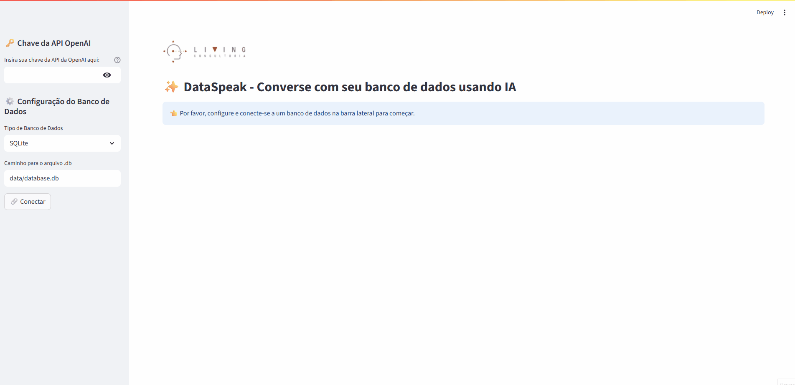

# ✨ DataSpeak - Converse com seu Banco de Dados usando IA

DataSpeak é uma plataforma de Business Intelligence (BI) conversacional que permite a qualquer usuário interagir com bancos de dados complexos usando apenas linguagem natural. Faça perguntas, peça por visualizações e forneça contexto de negócio para obter respostas precisas e insights rápidos, tudo através de uma interface de chat intuitiva.

Este projeto transforma a maneira como os dados são acessados, eliminando a necessidade de conhecimento em SQL e capacitando equipes a tomarem decisões baseadas em dados de forma ágil e segura.

## 🚀 Demo

 

**Exemplo de fluxo de trabalho:**
1.  **Conecte-se:** Insira suas credenciais para qualquer banco de dados suportado (SQL Server, PostgreSQL, etc.).
2.  **Pergunte:** "Qual o faturamento total no último trimestre, dividido por categoria de produto?"
3.  **Salve a Métrica:** Clique no ícone 🔖 ao lado da sua pergunta, dê o nome "Faturamento Trimestral por Categoria" e salve.
4.  **Visualize no Dashboard:** Navegue para a aba "Dashboard" e veja seu novo card. Clique em "Atualizar" para obter os dados mais recentes a qualquer momento.
5.  **Adicione Contexto:** Se o agente não entender um nome de tabela como `tbl_fat_05`, abra a modal "Editar Contexto" e adicione: "`tbl_fat_05` representa a tabela de faturamento de maio."

## ✨ Funcionalidades Principais

*   **Interface Unificada com Abas:** Uma experiência de usuário limpa e moderna com seções de "Chat" e "Dashboard" organizadas em abas (`st.tabs`).
*   **Conectividade Multi-DB (BYOD):** Suporte nativo para **SQL Server, PostgreSQL, MySQL e SQLite**, permitindo que os usuários conectem suas próprias bases de dados.
*   **Dashboard Dinâmico de Métricas:** Salve perguntas frequentes como "Métricas Chave" (KPIs) que aparecem como cards em um dashboard. Atualize os dados com um único clique.
*   **Contexto de Negócio Customizável:** Uma interface modal (`st.dialog`) permite que o usuário forneça um "dicionário de dados" para que a IA entenda nomenclaturas específicas da empresa, aumentando drasticamente a precisão.
*   **Agente Inteligente de Duas Etapas (Roteador de Tabelas):** Resolve o problema de "contexto muito longo" ao primeiro identificar as tabelas relevantes para a pergunta, garantindo eficiência e escalabilidade com bancos de dados grandes.
*   **Renderização de Cards Adaptativa:** O dashboard exibe os resultados de forma inteligente, renderizando números como métricas (`st.metric`), dados tabulares com `st.dataframe` e gráficos.
*   **Geração Dinâmica de Gráficos:** Crie visualizações de dados (`barras`, `pizza`) diretamente a partir de suas perguntas no chat ou no dashboard.
*   **Guardrail de Segurança:** Previne a execução de queries perigosas (`DROP`, `DELETE`, `UPDATE`), garantindo a integridade dos dados.
*   **Transparência Total:** Cada resposta no chat inclui um log de execução expansível, mostrando exatamente qual query SQL o agente executou.

## 🛠️ Tecnologias Utilizadas

*   **Linguagem:** Python 3.10+
*   **Framework de LLM:** 🧠 LangChain
*   **Modelo de Linguagem:** 🤖 OpenAI (GPT-4o ou configurável)
*   **Interface Web:** 📊 Streamlit
*   **Bancos de Dados Suportados:** 🗃️ SQL Server, PostgreSQL, MySQL, SQLite
*   **Drivers de Conexão:** SQLAlchemy, psycopg2, mysql-connector-python, pyodbc
*   **Visualização de Dados:** Matplotlib & Seaborn
*   **Armazenamento de Métricas:** JSON

## 📂 Estrutura do Projeto

O projeto segue uma arquitetura modular e escalável:

```
dataspeak-nlq/
├── app.py # Aplicação principal com Streamlit (UI e orquestração)
├── requirements.txt # Dependências do projeto
├── .env # Arquivo para configurações (desenvolvimento local)
│
├── pipeline/
│ ├── agent_pipeline.py # Lógica de criação e execução do agente de duas etapas
│ └── tools/
│ └── viz_tool.py # Ferramenta customizada para gerar gráficos
│
├── strategies/
│ └── llms/
│ └── openai_llm.py # Configuração e inicialização do LLM
│
├── data/
│ └── saved_questions.json # Armazena as métricas do dashboard
│
└── utils/
├── formatter.py # Limpeza de logs (remove códigos ANSI)
├── security.py # Módulo do Guardrail de segurança
└── storage.py # Funções para ler e escrever as métricas salvas
```

## ⚙️ Instalação e Configuração

Siga estes passos para executar o projeto localmente.

### 1. Pré-requisitos
Para conectar ao **SQL Server**, você precisa instalar o driver ODBC apropriado para seu sistema operacional.
- [Download do Microsoft ODBC Driver for SQL Server](https://learn.microsoft.com/en-us/sql/connect/odbc/download-odbc-driver-for-sql-server)

### 2. Clonar e Configurar o Ambiente
```bash
git clone https://github.com/seu-usuario/dataspeak-nlq.git
cd dataspeak-nlq

# Crie e ative um ambiente virtual
python -m venv .venv
source .venv/bin/activate  # ou .\.venv\Scripts\activate no Windows

# Instale as dependências
pip install -r requirements.txt
```

### 3. Configurar Variáveis de Ambiente
Para desenvolvimento local, crie um arquivo `.env` na raiz do projeto com o seguinte conteúdo:
```ini
# .env
OPENAI_LLM_MODEL="gpt-4o-mini"
OPENAI_TEMPERATURE=0.1
```
A chave da API da OpenAI será solicitada diretamente na interface da aplicação.

## ▶️ Como Executar

Com o ambiente configurado, inicie a aplicação Streamlit:

```bash
streamlit run app.py
```

Seu navegador abrirá automaticamente no endereço `http://localhost:8501`.

### Para Deploy (Streamlit Community Cloud)
1.  Faça o deploy do seu repositório.
2.  Nas configurações do app (`Settings > Secrets`), adicione os segredos para o modelo e a temperatura:
    ```toml
    # secrets.toml
    OPENAI_LLM_MODEL = "gpt-4o-mini"
    OPENAI_TEMPERATURE = 0.1
    ```

### Para Deploy em uma máquina virtual LINUX
1. Siga estes passos: [Linux](assets/install-linux.md) 

### Para Deploy em uma máquina virtual WINDOWS
1. Siga estes passos: [Windows](assets/install-windows.md) 


## 🗺️ Roadmap e Próximas Melhorias

*   [ ] **Suporte a NoSQL:** Adicionar conectividade para bancos de dados como MongoDB.
*   [ ] **Cache de Resultados do Dashboard:** Implementar um cache mais robusto (ex: st.cache_data) para os resultados do dashboard, evitando recálculos desnecessários.
*   [ ] **Geração de Relatórios Agendados:** Permitir que o usuário agende a atualização de um dashboard e receba o resultado por e-mail.
*   [ ] **Autenticação de Usuários:** Adicionar um sistema de login para que diferentes usuários tenham seus próprios dashboards salvos.

## 📄 Licença

Este projeto está licenciado sob a Licença MIT.